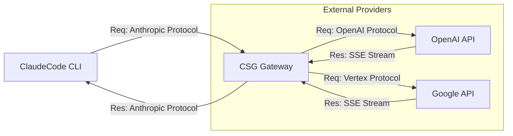

# Claude Subscription Gateway (CSG)

ClaudeCode CLI (`claude`) が、Anthropic APIの代わりに OpenAI (Codex) や Google (Antigravity/Gemini) のサブスクリプションを利用できるようにするローカルプロキシゲートウェイです。

## 概要

このプロジェクトは、中間者（Man-in-the-Middle）として動作するローカルサーバーを提供します。ClaudeCodeからのAnthropic API形式のリクエストを傍受し、認証情報の注入とプロトコル変換を行った上で、以下のバックエンドサービスへ転送します。

*   **OpenAI**: ChatGPT Plus/Pro/Team サブスクリプション (Codex CLI互換)
*   **Google**: Gemini Advanced / Google One AI Premium (Antigravity/Cloud Code互換)

これにより、API従量課金ではなく、既存の定額サブスクリプション権限でClaudeCodeを活用することが可能になります。

## 機能

*   **プロトコル変換**: Anthropic Messages APIのリクエスト/レスポンスをOpenAI/Gemini形式に相互変換
*   **ストリーミング対応**: Server-Sent Events (SSE) によるリアルタイムレスポンス変換により、スムーズな表示を実現
*   **認証マネージャー**: CLI向けのOAuthフロー（Device Flow / Loopback）を模倣し、トークンを安全に管理
*   **モデルルーティング**: リクエストされたモデル名に応じて適切なプロバイダーへ自動振り分け

## インストールとセットアップ

### 前提条件

*   Node.js (v18以上)
*   OpenAI または Google の有効なサブスクリプションアカウント

### インストール

```bash
git clone https://github.com/yohi/csd.git
cd csd
npm install
npm run build
```

## 使い方

### 1. ゲートウェイの起動

サーバーを起動してバックグラウンドで待機させます。

```bash
npm start
# または開発モード（ホットリロード有効）
npm run dev
```

デフォルトでは `http://localhost:4000` で起動します。

### 2. 認証 (初回のみ)

利用したいプロバイダーの認証を行います。ブラウザが起動し、ログインを求められます。

**OpenAI (Codex) の認証:**
```bash
npm run auth:codex
```

**Google (Antigravity) の認証:**
```bash
npm run auth:antigravity
```

現在の認証ステータスは以下のコマンドで確認できます。
```bash
npm run status
```

### 3. ClaudeCodeの設定

ClaudeCodeがローカルゲートウェイを経由するように環境変数を設定します。
(`.bashrc` や `.zshrc` に追加することを推奨します)

```bash
# ゲートウェイのアドレス
export ANTHROPIC_BASE_URL="http://localhost:4000"

# APIキーチェックを回避するためのダミーキー（ゲートウェイ側で無視されます）
export ANTHROPIC_API_KEY="sk-dummy-subscription-key"
```

### 4. ClaudeCodeの実行

ゲートウェイ経由でモデルを指定して実行します。

```bash
# GPT-4o を使用する場合
claude --model gpt-4o

# Gemini 1.5 Pro を使用する場合
claude --model gemini-1.5-pro
```

## 開発

*   **ビルド**: `npm run build`
*   **テスト**: `npm test`
*   **開発サーバー**: `npm run dev`

## アーキテクチャ



## 免責事項

本ツールは非公式の実験的プロジェクトです。各サービスプロバイダーの利用規約を遵守してご使用ください。意図しない利用方法によるアカウントの制限等について、開発者は責任を負いません。
